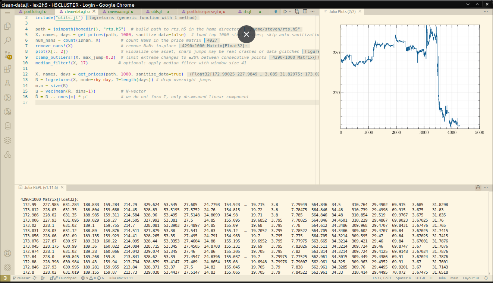

---
hide:
  - toc
---

The *Investors Exchange (IEX)* offers raw packet captures brimming with market microstructure — but let’s face it, wrangling `.pcap.gz` files isn't anyone’s idea of alpha. **IEX2H5** makes that data *instantly usable*.

* 🔍 **Turn raw PCAP into signals** — parses IEX TOPS trades and quotes straight from wire-speed Ethernet frames
* ⚡ **Streamline your edge** — compresses and structures data in fast, columnar **HDF5** format (ideal for ML, time-series, or quant research)
* 🔁 **Convert ticks to candles** — transform tick-level data into regularized ask,trade,bid matrices at any interval
* 🧠 **Designed for quants** — extract bid/ask flow, trade pressure, and instrument-level stats
* 🔄 **Multi-format I/O** — read/write in **HDF5**, **CSV**, **JSON**, or **Redis** for real-time and historical workflows
* 🌐 **Language-agnostic** — plug it into your stack: **Python**, **Julia**, **MATLAB**, **R**, or **C++** — no sweat
* 📈 **Built-in benchmarking** — know your latency, throughput, and storage profile across formats

Whether you're backtesting a stat-arb strategy, modeling market impact, or feeding deep learning pipelines — **IEX2H5 gets you from raw to alpha, fast**.



## ✨ Features at a Glance

* ⚙️ **Zero-hassle setup** — all third-party libraries are vendored in `thirdparty/`, no external dependencies or version mismatches
* 🚀 **C++23 low-latency core** — built with [H5CPP][102] custom filtering pipeline for maximum throughput
* 📦 **Plug-and-play output** — stores tick or OHLC data in HDF5, ready to consume from:

  * **Julia**: `HDF5.jl`, `JLD2.jl`
  * **Python**: `h5py`, `pandas`, `tables`
  * **MATLAB**: native HDF5 I/O
  * **C++**: [H5CPP][102], [HDF5 C API][105]
  * **Rust**: [hdf5 rust][103]
  * **R**: [hdf5r][104]
* 🔁 **Easily integrable** — works out of the box with your existing backtest engine, simulator, or research notebook
* 📊 **Flexible export formats** — convert to CSV, JSON, or Redis for real-time or post-trade analytics

## ⚡ From Raw Ticks to Clean RTS in Seconds
Get IEX market data flowing through your stack in just a few keystrokes.

```bash
# 1. Download the IEX TOPS dataset for August 1, 2025 or from 
iex-download --tops --from 2025-08-01

# 2. Convert the raw packet captures into a time-indexed HDF5 container
iex2h5 -o ~/iex.h5 --time-interval 00:01:00 ~/data/2025-08-??.pcap.gz
```
You now have compressed, columnar data ready for modeling, backtesting, or visualization — all within seconds.

## ⏱ Need Tick Data for Archival?
Grab every microsecond detail — then resample it later:

```bash
# Convert raw PCAP files to IRTS (tick-level HDF5 stream)
iex2h5 -o ~/iex.h5 --convert irts ~/data/2025-08-??.pcap.gz

# Downsample IRTS into 1-second RTS format asks/trades/bids + stats for analysis
iex2h5 -o ~/iex.h5 -o rts.h5 --time-interval 00:00:01 --date-range 2025-08-01:today
```

Whether you're reconstructing order flow or preparing factor inputs for your ML model — IEX2H5 gives you **full control over granularity** and **full speed without compromise**.

## Who It's For

<div style="display:flex; gap:24px; flex-wrap:wrap; align-items:stretch;">
  <!-- Traders & Quants -->
  <div style="flex:1 1 360px; min-width:320px; padding:16px 20px; border:1px solid var(--md-default-fg-color--lighter); border-radius:12px;">
    <h3 style="margin-top:0">💹 For Traders & Quants</h3>
    <ul>
      <li><strong>Backtesting at scale</strong> — plug HDF5 directly into your engine.</li>
      <li><strong>Alpha prototyping</strong> — ticks → features → PnL in minutes.</li>
      <li><strong>Market replay</strong> — reconstruct sessions & stress events.</li>
      <li><strong>Slippage & impact</strong> — quote/trade flow, execution timing.</li>
      <li><strong>Low-latency I/O</strong> — fast reads for factor & signal stacks.</li>
      <li><strong>Cross-format export</strong> — HDF5 ⇄ CSV/JSON/Redis for infra tests.</li>
    </ul>
  </div>

  <!-- Researchers & Data Scientists -->
  <div style="flex:1 1 360px; min-width:320px; padding:16px 20px; border:1px solid var(--md-default-fg-color--lighter); border-radius:12px;">
    <h3 style="margin-top:0">🧪 For Researchers & Data Scientists</h3>
    <ul>
      <li><strong>Clean, structured datasets</strong> — columnar, indexed HDF5.</li>
      <li><strong>Microstructure studies</strong> — quote dynamics, trade pressure.</li>
      <li><strong>ML & stats pipelines</strong> — PCA, factors, deep nets, RL.</li>
      <li><strong>Reproducible experiments</strong> — fixed schema & versioned data.</li>
      <li><strong>Language-agnostic</strong> — Julia, Python, MATLAB, R, C++.</li>
      <li><strong>Teaching & labs</strong> — realistic data without live-feed hassles.</li>
    </ul>
  </div>
</div>

[100]: https://iextrading.com/trading/market-data/
[101]: https://www.iexexchange.io/legal/hist-data-terms
[102]: https://github.com/steven-varga/h5cpp
[103]: https://github.com/aldanor/hdf5-rust
[104]: https://github.com/hhoeflin/hdf5r
[105]: https://support.hdfgroup.org/documentation/